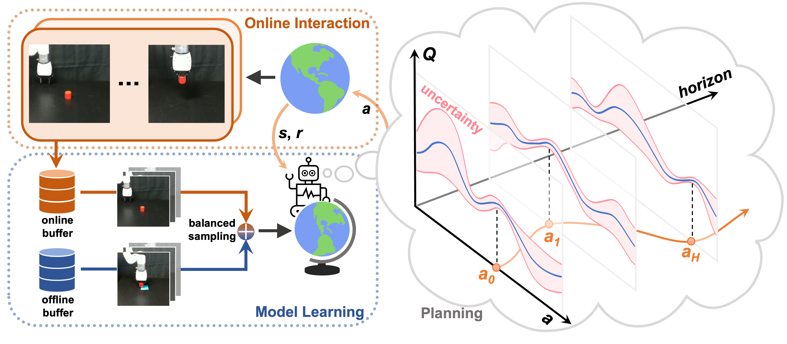

# Finetuning Offline World Models in the Real World

Official PyTorch implementation of [Finetuning Offline World Models in the Real World](https://yunhaifeng.com/FOWM) (CoRL 2023 Oral)

[Paper](https://arxiv.org/abs/2310.16029) | [Website](https://yunhaifeng.com/FOWM) | [Dataset (sim)](https://drive.google.com/file/d/1nhxpykGtPDhmQKm-_B8zBSywVRdgeVya/view?usp=sharing) | [Dataset (real)](https://drive.google.com/file/d/1PRCqANEOV0SICLEWEvUL9AnyJOe2UMYK/view?usp=sharing)



## 主な変更点 (Major Changes)
[最終課題プロジェクトリンク](https://prism.openai.com/?u=3ca79a48-23bf-46b8-834d-870f65a8256c&pg=1&m=main.tex&d=7)

本リポジトリは [yunhaif/fowm](https://github.com/yunhaif/fowm) をベースに、オンライン・ファインチューニングの効率化と実験の公平性を向上させるための以下の機能を追加しています。

1. **アーキテクチャの拡張**
   - **Encoder Freezing**: `freeze_encoder` オプションにより、ファインチューニング中にエンコーダの重みを固定可能です。
   - **LoRA (Low-Rank Adaptation)**: Dynamics モデルと Reward モデルに対して LoRA を適用可能です。元の重みを固定したまま、低ランク行列のみを学習することで効率的な適応を実現します。

2. **実験パイプラインの分離 (2-Stage Training)**
   - **Stage 1 (Offline Pretraining)**: `src/train_offline.py` により、オフラインデータセットのみを用いてベースモデルを学習・保存します。
   - **Stage 2 (Online Fine-tuning)**: `src/train_online.py` により、保存されたベースモデルを読み込み、即座にドメインシフト環境でのオンライン学習を開始します。これにより、全手法で同一の初期状態からの公平な比較が可能になりました。

3. **動的なモデル適応 (Dynamic Adaptation)**
   - `TDMPC.apply_adaptation()` メソッドの実装により、事前学習済みの標準モデルに対して、オンラインフェーズ開始のタイミングで動的に LoRA の適用やエンコーダの固定を行えるようになりました。

4. **実験の自動化と可視化**
   - **run_experiments.py**: 4つのドメインシフト（Baseline, Heavy Load, High Friction, Mix Severe）と3つの手法（Full-FT, Encoder-Frozen, Dynamics-LoRA）の計12パターンの実験を自動実行します。
   - **plot_results.py**: 複数手法の学習曲線を1つのグラフにプロットし、シード間の平均と標準偏差（影付きエリア）を可視化します。

5. **環境構築の改善**
   - `mujoco_py` の `LD_LIBRARY_PATH` に関するエラーを自動的に解決する処理を追加しました。

## Installation


Install dependencies using `conda`:

```
conda env create -f environment.yaml
conda activate fowm
```

## Training

After installing dependencies, you can train an agent by
```
python src/train_off2on.py task=antmaze-medium-play-v2
```
Supported tasks from [D4RL](https://github.com/Farama-Foundation/D4RL): `antmaze-medium-play-v2`, `antmaze-medium-diverse-v2`, `hopper-medium-v2`, `hopper-medium-replay-v2`.

To run experiments on xArm tasks, first download our released offline datasets
```
python scripts/download_datasets.py
```
Datasets will be saved at the directory `data`:
```
data
├── xarm_lift_medium
├── xarm_lift_medium_replay
├── xarm_push_medium
└── xarm_push_medium_replay
```

Then start training with 
```
python src/train_off2on.py modality=all task=xarm_lift dataset_dir=data/xarm_lift_medium_replay
```
You can choose `xarm_lift` or `xarm_push` as `task` and use `dataset_dir` to specify the offline dataset.

The training script supports both local logging as well as cloud-based logging with [Weights & Biases](https://wandb.ai). To use W&B, provide a key by setting the environment variable `WANDB_API_KEY=<YOUR_KEY>` and add your W&B project and entity details to `cfgs/config.yaml`.

## Monitoring Training

### Console Output
During training, the console displays progress in the following format:
`train   E: 10   P: Off   S: 1000/50000   R: 15.5   T: 0:05:21`

- **E (Episode)**: Number of completed episodes.
- **P (Phase)**: Current training phase (`Off` for Offline, `On` for Online).
- **S (Step)**: Progress ratio shown as `current_steps / total_steps`.
- **R (Reward)**: Total reward obtained in the current/latest episode (or average).
- **T (Time)**: Elapsed time since the start of training.

### Configuration vs. Output
The relationship between configuration parameters (e.g., in `cfgs/tasks/xarm_lift.yaml`) and the console output is as follows:

| Parameter | Console Correlation | Description |
| :--- | :--- | :--- |
| `train_steps` | Denominator of `S` | Total number of internal model update steps. |
| `action_repeat` | Environment multiplier | Number of environment steps per agent action. |
| `offline_steps` | Phase transition | Threshold (in steps) to switch from `Off` to `On` phase. |
| `eval_freq` | Frequency of `green` logs | Interval (in environment steps) for evaluation. |

**Note**: The console step (**S**) shows the **internal update steps**. The actual environment steps (env_step) used for evaluation and logging frequency are `S × action_repeat`. For example, if `S` reaches 50,000 and `action_repeat` is 2, the total environment steps will be 100,000.

## Running Multiple Experiments & Plotting

To run experiments for multiple tasks and seeds (e.g., `xarm_lift` and `xarm_push` with 5 seeds each) and generate aggregated learning curves, you can use the provided utility scripts.

### 1. Run all experiments
Executing the following script will run 10 training sessions sequentially (2 tasks x 5 seeds). It automatically sets up the necessary environment variables for MuJoCo and generates a plot once all training is complete.
```bash
./scripts/run_experiments.sh
```

### 2. Manual Plotting
If you already have log data in the `logs/` directory and want to generate or update the plot (mean reward with standard deviation area), run:
```bash
python plot_results.py
```
The result will be saved as `learning_curves.pdf`.

## Citation
If you find our work useful in your research, please consider citing with the following BibTeX:
```
@inproceedings{feng2023finetuning,
  title={Finetuning Offline World Models in the Real World},
  author={Feng, Yunhai and Hansen, Nicklas and Xiong, Ziyan and Rajagopalan, Chandramouli and Wang, Xiaolong},
  booktitle={Proceedings of the 7th Conference on Robot Learning (CoRL)},
  year={2023}
}
```

## License & Acknowledgements
This repository is licensed under the MIT license. The codebase is based on the original implementations of [TD-MPC](https://github.com/nicklashansen/tdmpc). 
